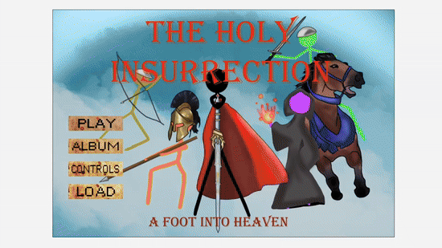
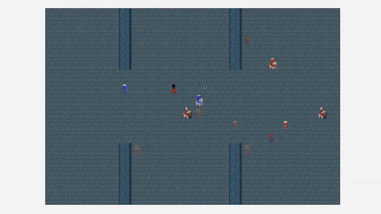
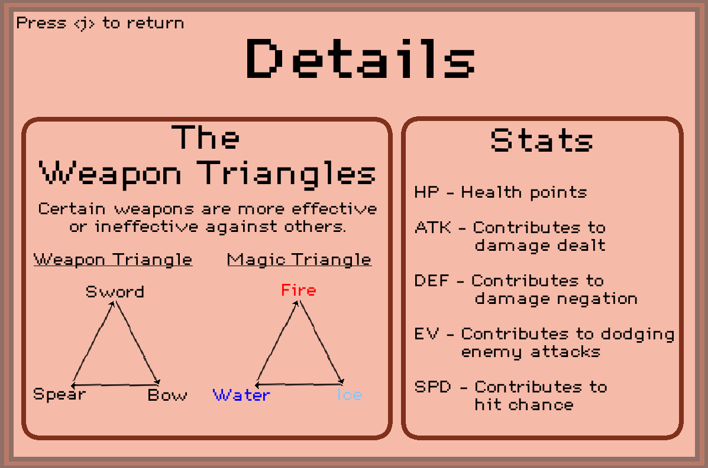
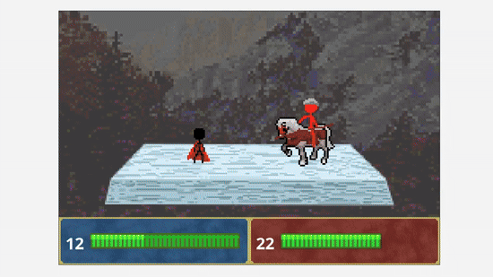
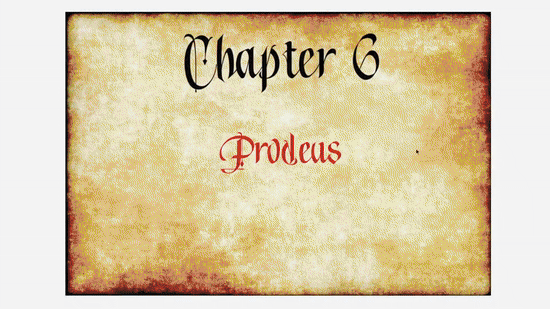
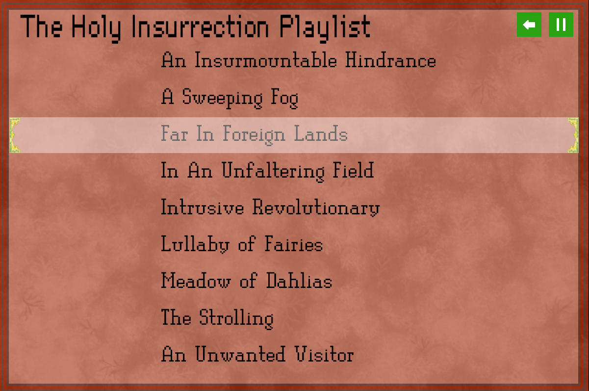

## A Foot Into Heaven
> "A Foot Into Heaven" is a turn based game where the main character embarks on a mission to reclaim the throne from The Being.  

It takes great inspiration from "Fire Emblem", particularly the Game Boy Advance iterations.  

> Beginning of the game

> The final boss fight, where "Blade of Eithalon" is attained

## Features

### Weapon Triangle
> The crux of any "Fire Emblem" title  

In the game, each character is of a specfic class and each class has their own set of weapons.  
Each weapon is both weak and strong against a certain other weapon, forming a weapon triangle:  

### Implementation Details
- Pathfinding (bfs) is used to implement character movement
- Inheritance was used to share common state and behaviour between the various game entities  
- Units have 5 different stats (MaxHealth, ATK, DEF, EV, SPD) that were used to calculate damage and crit chance

### User Interface
- Menu can be accessed during the game through `esc`
- `j` is used to cancel actions and serves as the "back" key
- All controls are visually displayed as the game is played

## Assets and Illustrations

### The Art
> All hand-drawn  

Attention was put into making each animation deliver impact, particularly the critical strikes.  

  

### The Music
> An original soundtrack

Most of the songs listed are made by first starting with an AI generated sample, which was then heavily tuned and adjusted.  
[Soundtracks](A-Foot-Into-Heaven/sounds/)  

## Closing
- All art, story, and game concepts were made by Jonathan Zhao (no socials)  
- Credits to [Danpost](https://www.greenfoot.org/users/2991) for the TextImage class  
- Game runs on "Greenfoot" - a Java framework  
